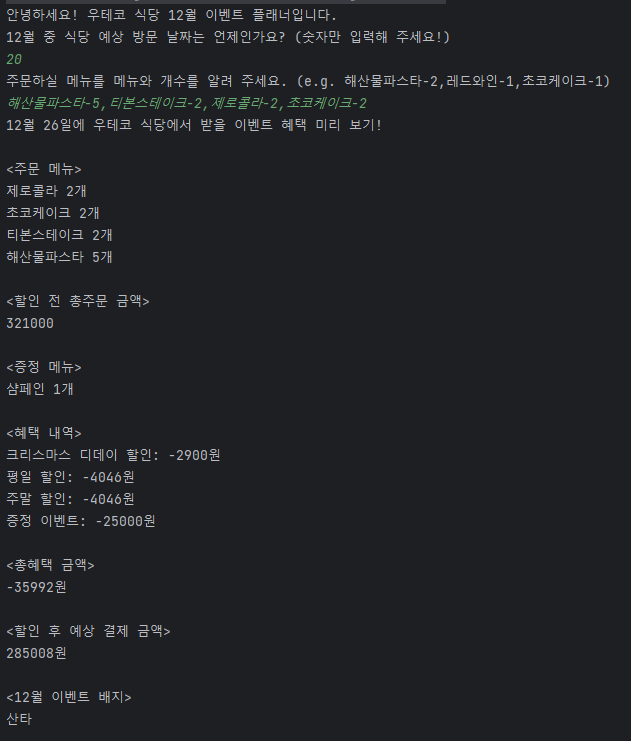
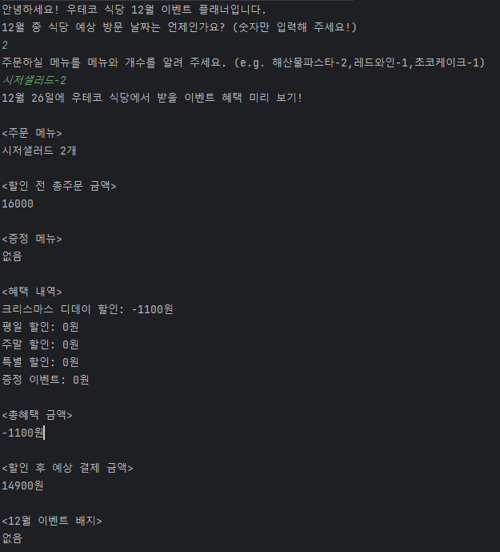

    

# 프리코스 4주차 미션 - 크리스마스 프로모션

---

> 우아한테크코스 6기 4주차 미션, 크리스마스 프로모션을 구현한 저장소입니다.

 

---

# 목차
- 기능목록
- 패키지구조
---

## 기능 목록

- 입력
  - 식당 방문 날짜 입력
    - 1이상 31이하의 숫자로만 입력가능하다
  - 주문 메뉴와 개수 입력
    - 입력 형식에 맞게 입력해야한다
    - 메뉴판에 있는 메뉴만 입력가능하다
    - 메뉴의 개수는 1이상의 숫자만 입력가능하다
    - 중복된 메뉴는 입력 불가능하다
  
- 출력
  - 이벤트 인트로 메시지 출력
  - 이벤트 혜택 미리보기 메시지 출력
  - 주문 메뉴 출력
  - 할인 전 총 주문 금액 출력
  - 증정 메뉴 출력
  - 혜택 내역 출력
  - 총 혜택 금액 출력
  - 할인 후 예상 결제 금액 출력
  - 배지 여부 출력

- 메뉴
  - 메뉴는 1개 이상이어야한다
- 주문
  - 음료만 주문할 수 없다
  - 메뉴는 중복되면 안된다
  - 메뉴는 20개까지만 주문 가능
- 할인 계산기
  - 이벤트는 할인전 총 주문 금액이 10,000원 이상이어야 참여가능하다
  - 크리스마스 디데이 할인'을 제외한 다른 이벤트는 2023.12.1 ~ 2023.12.31 동안 적용
  - 디데이할인
    - 1,000원으로 시작하여 크리스마스가 다가올수록 날마다 할인 금액이 100원씩 증가
  - 주간할인
    - 평일 할인(일요일~목요일): 평일에는 디저트 메뉴를 메뉴 1개당 2,023원 할인
    - 주말 할인(금요일, 토요일): 주말에는 메인 메뉴를 메뉴 1개당 2,023원 할인
  - 특별할인
    - 이벤트 달력에 별이 있으면 총주문 금액에서 1,000원 할인
  - 증정이벤트
    - 할인 전 총주문 금액이 12만 원 이상일 때, 샴페인 1개 증정
    
- 배지
  - 별: 5천원 이상
  - 트리 : 1만원 이상
  - 산타 : 2만원 이상
  
---

## 패키지 구조
- controller
  - MainController: 다른 컨트롤러를 중재하는 메인컨트롤러
  - OrderController: 주문 받는 역할을 하는 컨트롤러
  - EventController: 할인 이벤트를 적용하는 컨트롤러
  - PaymentController: 결제를 담당하는 컨트롤러
- domain
  - event
    - designationEvent
      - EventConfig: 배지 Config를 담는 클래스
      - BadgeEvent: 배지 이벤트를 담당하는 클래스
    - discountEvent
      - EventConfig: 할인 Config를 담는 클래스
      - GiftEvent: 증정 이벤트를 담당하는 클래스
      - D_DayEvent: 디데이 이벤트를 담당하는 클래스
      - SpecialEvent: 특별 할인을 담당하는 클래스
      - WeekdayEvent: 평일 할인을 담당하는 클래스
      - WeekendEvent: 주말 할인을 담당하는 클래스
  - menu
    - MenuCategory: 메뉴들을 담고 있는 Enum클래스
  - order
    - dto
      - AmountDto: 결제 컨트롤러에 값을 보내는 Dto
      - MenuQuantityDto: 메뉴와 메뉴 개수들을 전달하기 위한 Dto
    - Order: 주문 정보를 담고있는 클래스
    - OrderAmount: 총 주문 금액을 계산하는 클래스
    - OrderConfig: 주문 Config를 담는 클래스
- exception
  - ErrorMessage: 에러 메시지를 담고 있는 클래스
  - ChristmasException: 크리스마스 이벤트 에러를 담당하는 클래스
- service
  - EventService: 할인 이벤트 로직을 담당하는 서비스 클래스
- view
  - input
    - InputView: 입력 화면을 담당하는 클래스
  - output
    - EventView: 이벤트 출력 뷰를 담당하는 클래스
    - OrderView: 주문 출력 뷰를 담당하는 클래스
    - PayView: 지불 출력 뷰를 담당하는 클래스